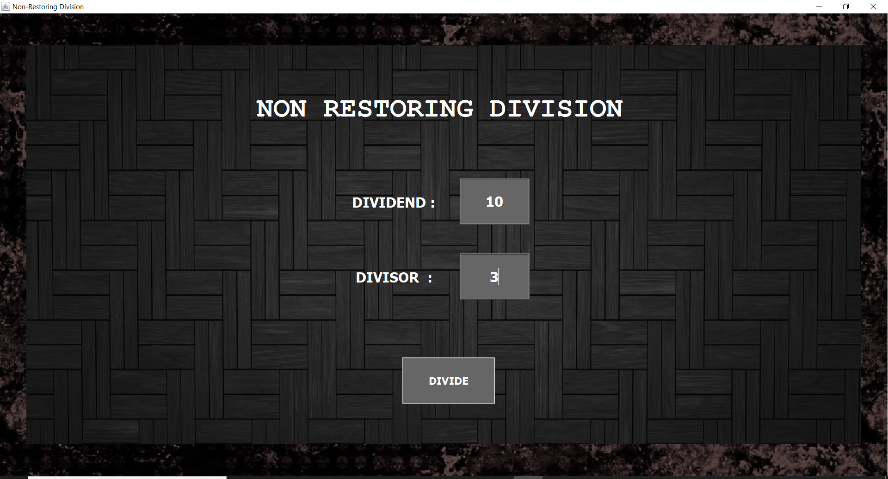
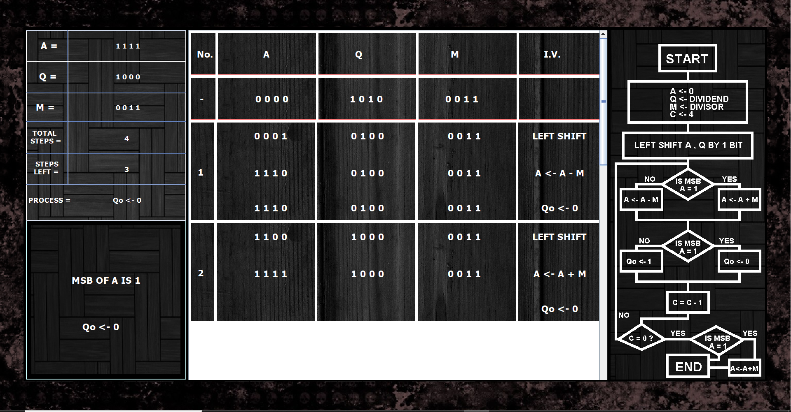
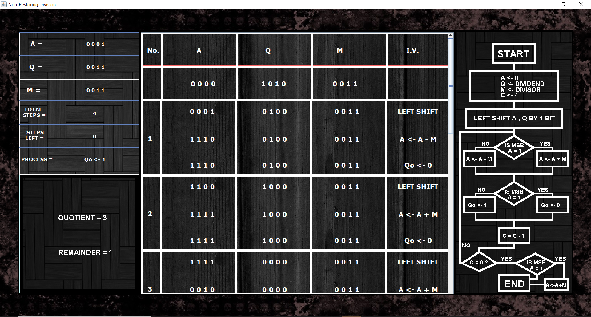

# Non-Restoring-Division-Visualizer
A GUI Visualizer showing the operations performed in non-restoring division made using Java Swing GUI

Steps to Execute - 

1) Open the project file in an IDE (Netbeans preferably)

2) Run the 'CoaProj.java' file

Screenshots  - 

